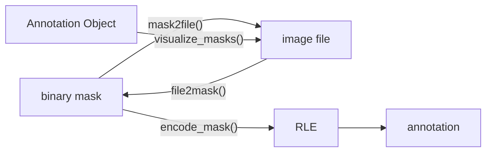

# Annotation Tools

Anything that helps with annotation! :)

match_annotate(deprecated): 使用预先定义的图片进行屏幕图像匹配，自动点点，方便使用 labelme 进行标注。不过现在有了 Segment Anything，就不需要它了！ 

## 标注过程

1. 图片放在文件夹 "images" 下
2. init_COCO 扫描图片文件并生成原始 COCO json 文件
2. 通过 Annotator 加载图片并进行标注，标注以 .pickle 文件的形式保存，标注可以随时终止。
3. 所有图片标注完成后，使用 export_COCO 合并标注并生成标准格式的 COCO json 文件。

## 代码逻辑

### Form of Annotations 标注的存在形式

1. binary masks (bool ndarray) (Segment Anything 获得)
2. image mask files (int8 ndarray) (just for visualization)
3. RLE segmentation
4. annotation (a complete annotation includes RLE segmentation and other infos)
5. Annotation Object



### File Structure

假设指定存放图片的文件夹为 "images"，约定标注时的文件结构(standard file structure)：
- 图片都直接位于 "images" 且后缀名为".jpg"
- 标注文件将在 `images/annotation.json` 处生成，标注文件内图片的 filename 只包括文件名
- 标注生成的 pickle 文件以及 mask 图片存放于 `images/mask` 且与对应的图片重名

> **Warning**: 默认情况下，程序会创造上述文件结构，不要移动文件位置，否则程序可能找不到之前的标注。

## 数据集

1-634 缺少 122，一共 633 个

## 数据集类型转化

> below are transform labelme annotation to coco style, don't use it anymore.

- create labels.txt

    ```
    __ignore__
    date
    fig
    hazelnut
    ```

- `conda activate labelme`
- `python labelme_to_coco.py --labels data/nuts/images/labels.txt data/nuts/images data/nuts --noviz`

or: run `labelme2coco.py` (more simple, might error)

> path formate is different, be careful