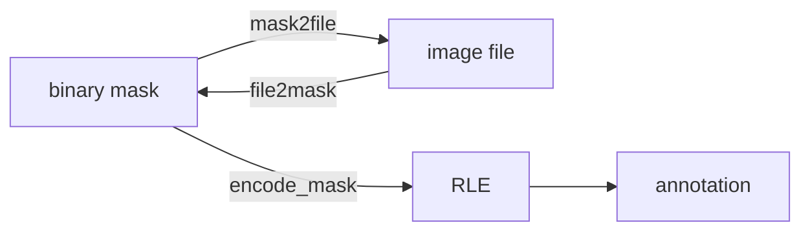

# Annotation Tools

Anything that helps with annotation! :)

match_annotate(deprecated): 使用预先定义的图片进行屏幕图像匹配，自动点点，方便使用 labelme 进行标注。不过现在有了 Segment Anything，就不需要它了！ 

标注的几个存在形式：
1. binary masks (ndarray) (Segment Anything 获得)
2. image files
3. RLE segmentation
4. annotation (a complete form of annotation)

